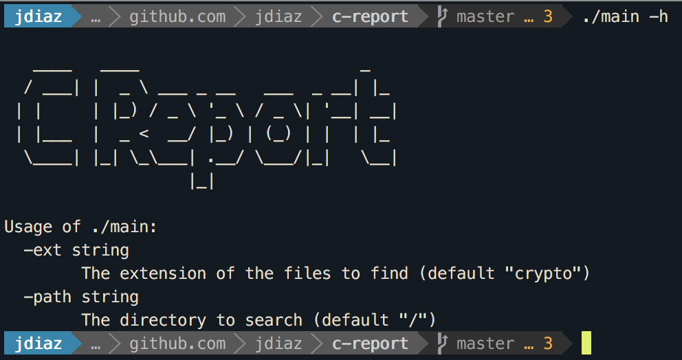
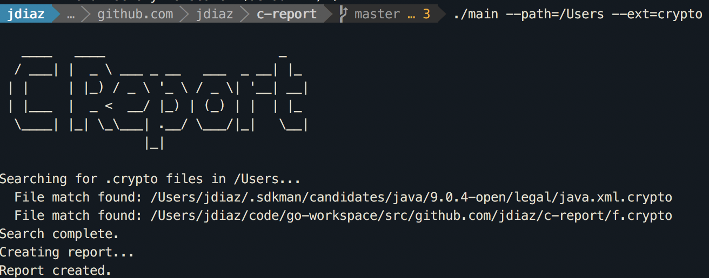
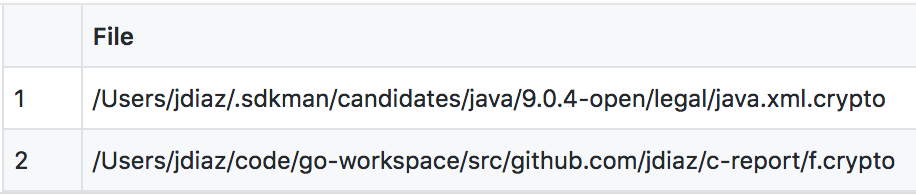

C Report
========

C report is a CLI tool that scans a given directory in an attempt to find files matching desired file extension. The results are conveniently written to a CSV file.

#### UNIXish Usage

**Help**

**Run**

#### Windows Usage

**Output**

## License & Distribution
The distribution file has built versions for both Mac and windows. Code is distributed under the MIT license, knock youself out.